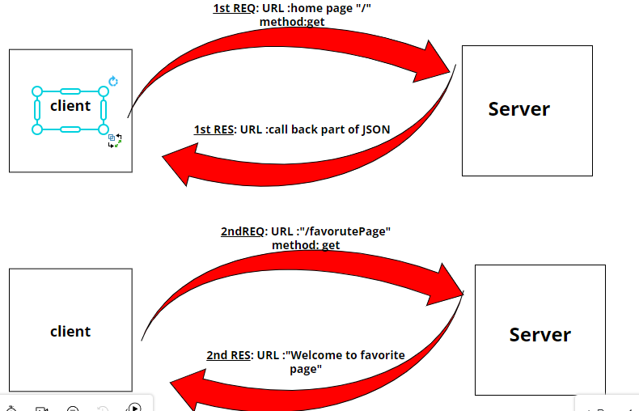

# Movies-Library

# Movies-Library -(1.0.0)

**Author Name**: Sozan Alzubiedy

## WRRC

## Overview
I created a server of the movi Application

## Getting Started
1. I Created a repository called Movies-Library 
2. I  started my project by running the command "npm init -y 
3. Install the required packages
4. Build the following routes :Home Page , faviorite Page ,and addedd  handeling error
5. sending request by using Thunder and can reasult of respose.

## Project Features
When i sent a request with"/" to get part of JSON data that related to movei as title ,overveiw
and when i sent a request with "/favorite" and send this response "Welcome to favorite Page
