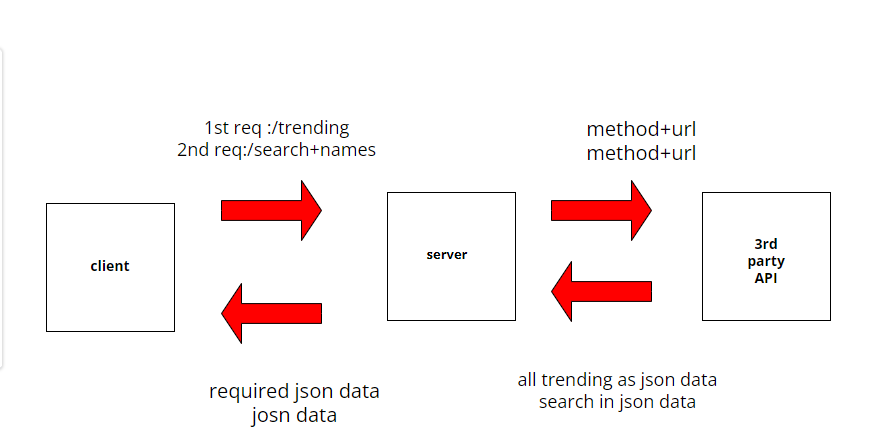

# Movies-Library

# Movies-Library -(1.0.0)

**Author Name**: Sozan Alzubiedy

## WRRC

## Overview
I created a server of the movi Application

## Getting Started
1. I Created a repository called Movies-Library 
2. I  started my project by running the command "npm init -y 
3. Install the required packages
4. Build the following routes :Home Page , faviorite Page ,and addedd  handeling error
5. sending request by using Thunder and can reasult of respose.

about task 12 : 
1. Install the required packages npm install axios dotenv
2. created my Abi key
3. Created GET request to the 3rd party API for :
/trending ,/search ,and another 2 routes
4. i used this Resources: Express doc ,NPM doc, Dotenv, axios

## Project Features
When i sent a request with"/" to get part of JSON data that related to movei as title ,overveiw
and when i sent a request with "/favorite" and send this response "Welcome to favorite Page

about Task 12 : 
* created /trending to Get the trending movies data from the Movie DB API url

* created /search: Search for a movie name to get its information of the specific url

## Question:
1.	What observations or questions do you have about what you’ve learned so far?

* we learned about  a Promise 
* and the difference betwwen Async vs sync and java is asynic  and single threaded 

2.	How long did it take you to complete this assignment? And, before you started, how long did you think it would take you to complete this assignment?

about 8 hours ....I thought it take less time

## Getting Started  (About Task 13 )

1. Install the required packages for this task: npm install pg

2. Setup the database environmentnt :
     * creat database called movi
     * creat table called moviTable in schema.sql 
     * connect the database with table by this command     (psql -d movi -f schema.sql)
3. creat 2 routes one for add by sing post and another one by get 
4. used client.query()  to do CRUD .

##we used this Resources 
1. [SQL][https://sqlbolt.com/]
2. [SQL Practice][https://www.w3schools.com/sql/trysql.asp?filename=trysql_select_all]
3. [SQL sheetcheat][http://www.cheat-sheets.org/sites/sql.su/]

## Project Features
#About Task 13
* We craeted dataBase and table after we connected of them we send a req (post) to add movies  
then we can read the moves we added it by using routes called getmoves.

## Question: #About Task 13
1.	What observations or questions do you have about what you’ve learned so far?

we learened how to add and get the data 
my question how to delete and update in database?
and how can use more than one table because we just craet one table and connected it .

2.	How long did it take you to complete this assignment? And, before you started, how long did you think it would take you to complete this assignment?

about 9 hours ....I thought it take 6 hours
